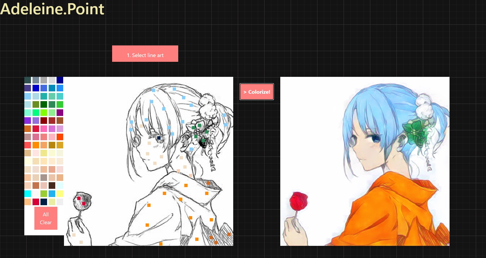

# Adeleine

## Summary

- A simple GUI application of colorization based on three types of hints!
  - Reference: colorization based on reference images
  - Flatten: colorization based on scribble hints
  - Point: colorization based on point hints
