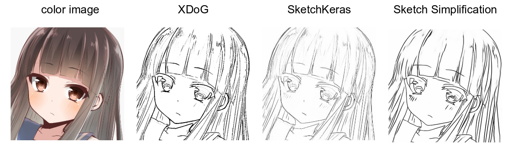
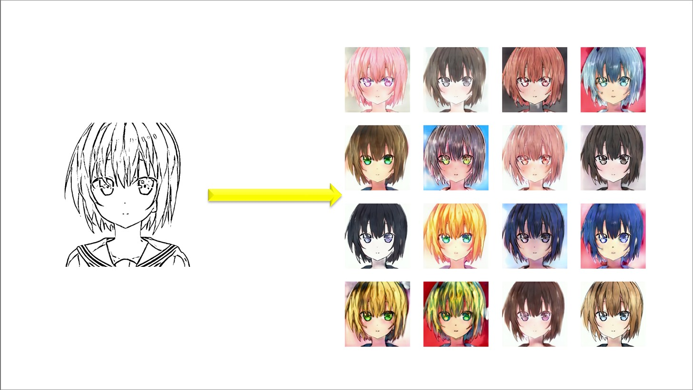
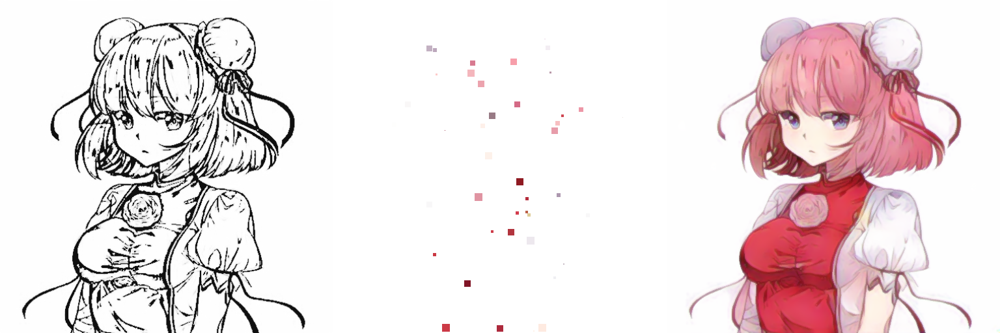
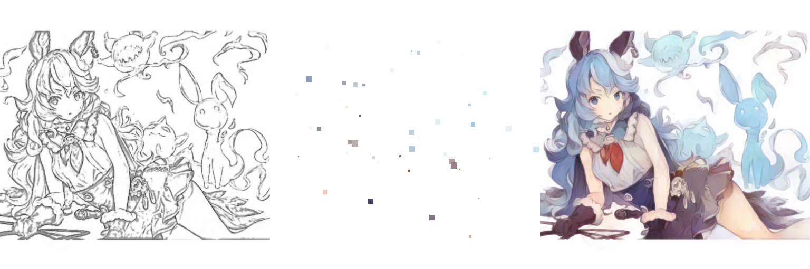
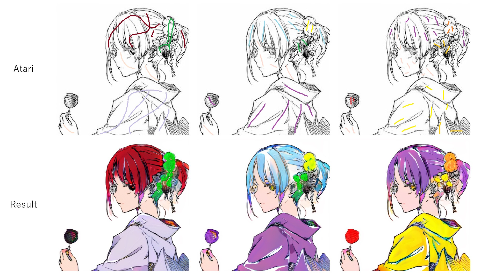
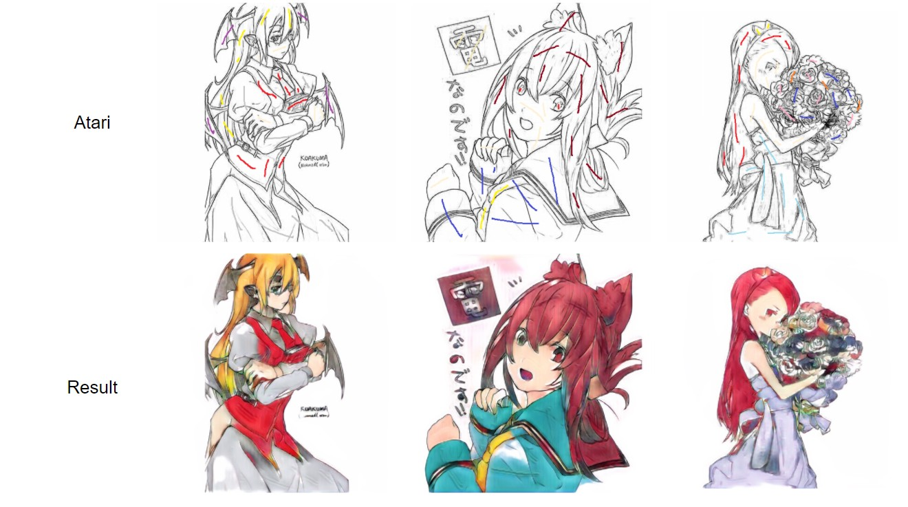
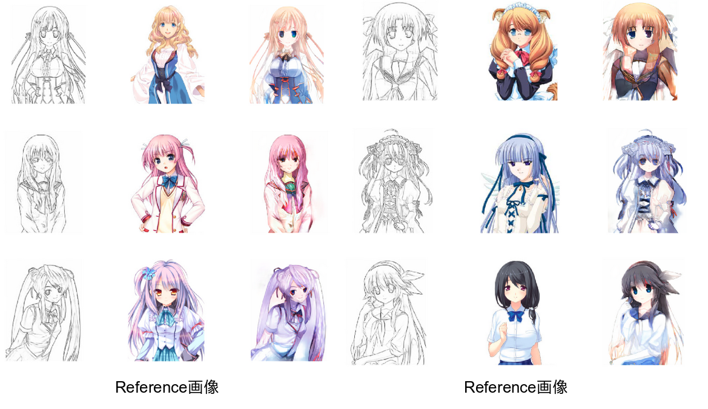
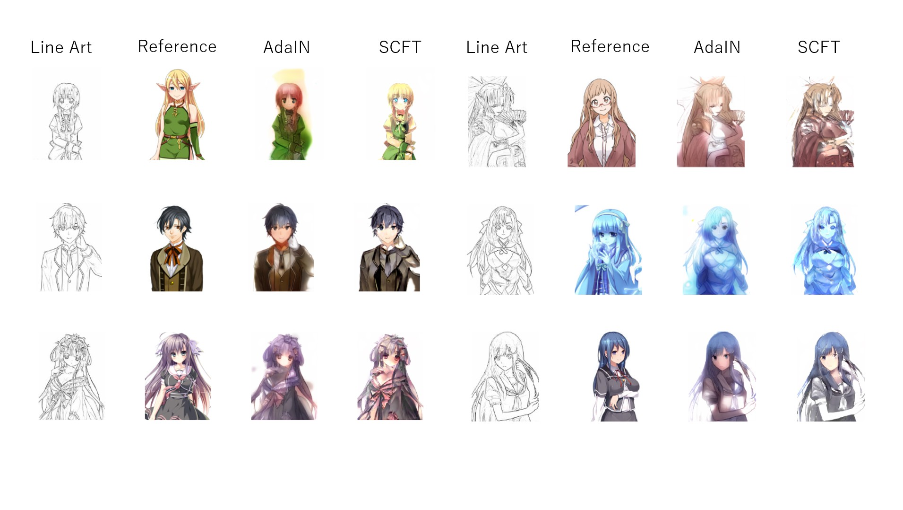
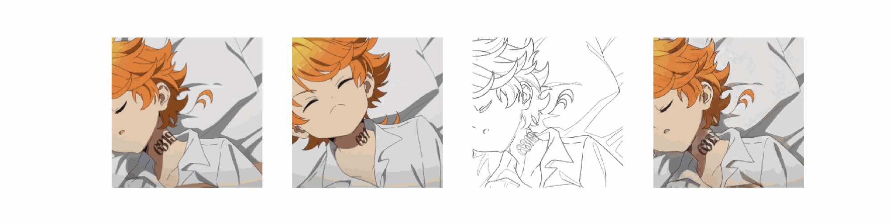
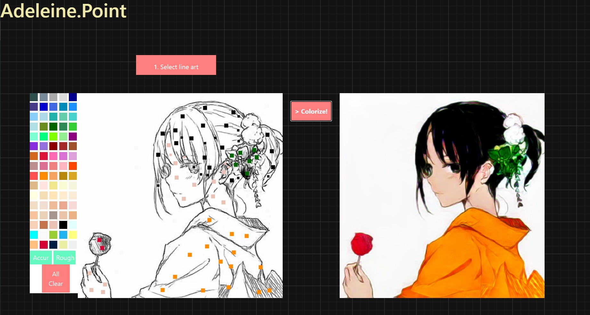

# Automatic Line Art Colorization

## Overview
This repository is about automatic line art colorization with deep learning. In addition to training the neural network with line arts only, this repository aims to colorize with several types of hints. There are mainly three types of hints.
  
- Atari: Colorization with hints that include some lines in desired color (ex. PaintsChainer)
- Tag: Colorization with tags (ex. Tag2Pix)
- Reference: Colorization with reference images (ex. style2paints V1)
  
## Line extraction method
There are many kinds of line extraction methods, such as XDoG or SketchKeras. If we train the model on only one type of line art, trained model comes to overfit and cannot colorize another type of line art properly. Therefore, like Tag2Pix, various kinds of line arts are used as the input of neural network.

I use mainly three types of line art.

- XDoG
  - Line extraction using two Gaussian distributions difference to standard deviations
  
- SketchKeras
  - Line extraction using UNet. Lines obtained by SketchKeras are like pencil drawings.
  
- Sketch Simplification
  - Line extraction using Fully-Convolutional Networks. Lines obtained by Sketch Simplification are like digital drawings.

An example obtained by these line extraction methods is as follows.  

Moreover, I add two types of data augmenation to line arts in order to avoid overfitting.

- Randomly morphology transformation to deal with various thicks of lines
- Randomly RGB values of lines to deal with various depths of lines

## Experiments without hints

### Motivation
First of all, I needed to confirm that methods based on neural networks can colorize without hint precisely and diversely. The training of mapping from line arts to color images is difficult because of variations in color. Therefore, I hypothesized that neural networks trained without hints would come to colorize single color in any regions. In addition to content loss, I tried adversarial loss because this loss function enables neural networks to match data distribution adequately.

### Methods
- [x] pix2pix
- [x] pix2pixHD
- [X] bicyclegan

### Results
| Method | Result |
| ---- | ---- |
| pix2pix & pix2pixHD |  |
| bicyclegan |  |

## Experiment with atari

### Motivation
Considering the application systems of colorization, we need to colorize with designated color. Therefore, I tried some methods that take the hint, named atari, as input of neural network.

### Methods
- [x] userhint
- [x] userhint v2
- [x] whitebox
- [x] spade

### Results
| Method | Result |
| ---- | ---- |
| userhint |  |
| userhint v2 |   |
| whitebox |  |
| spade |  |

## Experiment with reference

### Motivation
I also consider taking the hint, named reference, as input of neural network. At first, I had tried to implement style2paints V1. However, I had difficulities reproducing the results because training came to collapse. Then, I decided to seek for substitutes for style2paints V1.

### Methods
- [x] adain
- [x] scft
- [x] video

### Results
| Method | Result |
| ---- | ---- |
| adain | 
| scft | 
| video |  |

## GUI application

- A simple GUI application, named Adeleine, can be used!

## References
- [XDoG: An eXtended difference-of-Gaussians compendium including advanced image stylization](https://users.cs.northwestern.edu/~sco590/winnemoeller-cag2012.pdf)
- [sketchKeras](https://github.com/lllyasviel/sketchKeras)
- [Learning to Simplify: Fully Convolutional Networks for Rough Sketch Cleanup](https://esslab.jp/~ess/publications/SimoSerraSIGGRAPH2016.pdf)
- [Image-to-Image Translation with Conditional Adversarial Networks](https://arxiv.org/pdf/1611.07004.pdf)
- [High-Resolution Image Synthesis and Semantic Manipulation with Conditional GANs](https://arxiv.org/pdf/1711.11585.pdf)
- [Toward Multimodal Image-to-Image Translation](https://arxiv.org/pdf/1711.11586.pdf)
- [Arbitrary Style Transfer in Real-time with Adaptive Instance Normalization](https://arxiv.org/pdf/1703.06868.pdf)
- [Mode Seeking Generative Adversarial Networks for Diverse Image Synthesis](https://arxiv.org/pdf/1903.05628.pdf)
- [Semantic Image Synthesis with Spatially-Adaptive Normalization](https://arxiv.org/pdf/1903.07291.pdf)
- [Real-Time User-Guided Image Colorization with Learned Deep Priors](https://arxiv.org/pdf/1705.02999.pdf)
- [Style Transfer for Anime Sketches with Enhanced Residual U-net and Auxiliary Classifier GAN](https://arxiv.org/pdf/1706.03319.pdf)
- [Two-stage Sketch Colorization](http://www.cse.cuhk.edu.hk/~ttwong/papers/colorize/colorize.pdf)
- [Tag2Pix: Line Art Colorization Using Text Tag With SECat and Changing Loss](https://openaccess.thecvf.com/content_ICCV_2019/papers/Kim_Tag2Pix_Line_Art_Colorization_Using_Text_Tag_With_SECat_and_ICCV_2019_paper.pdf)
- [Reference-Based Sketch Image Colorization using Augmented-Self Reference and Dense Semantic Correspondence](https://arxiv.org/pdf/2005.05207.pdf)
- [Learning to Cartoonize Using White-box Cartoon Representations](https://github.com/SystemErrorWang/White-box-Cartoonization/blob/master/paper/06791.pdf)
- [Deep Line Art Video Colorization with a Few References](https://arxiv.org/pdf/2003.10685.pdf)
- [DanbooRegion: An Illustration Region Dataset](https://lllyasviel.github.io/DanbooRegion/paper/paper.pdf)
