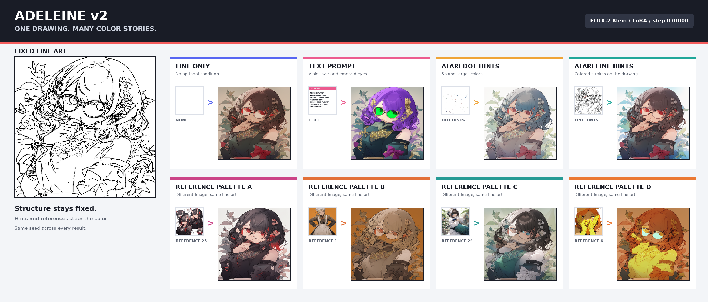
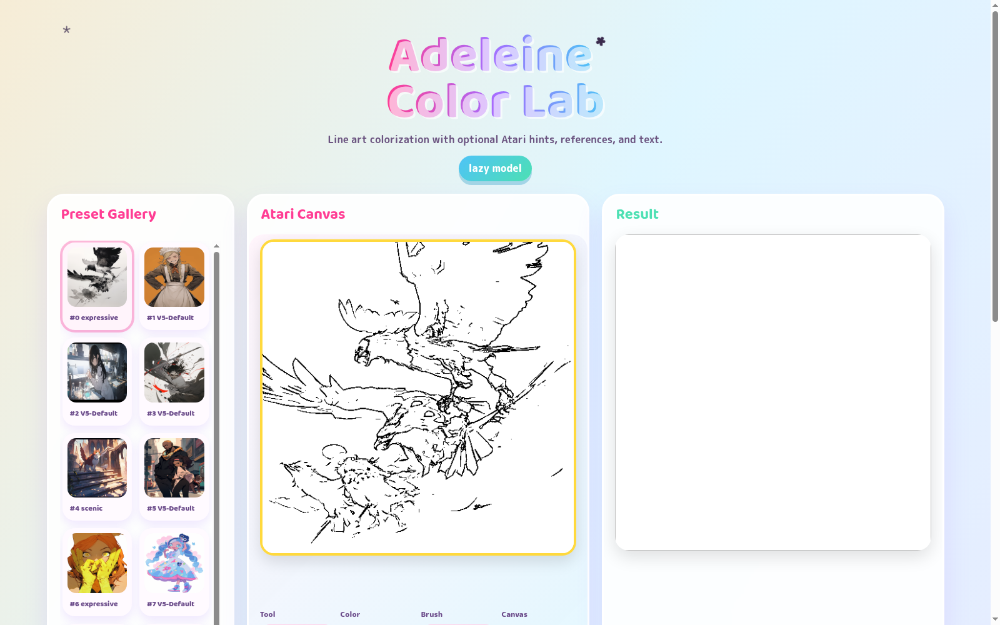

# Adeleine v2



All-in-one FLUX.2 Klein colorization with optional text, Atari dot/line hints, or reference images. The figure uses the step-70k checkpoint with one fixed line art and diffusion seed, including text, dot and line hints, and four unrelated reference palettes.

## Web Demo



## Inputs

- `lineart`: required
- `atari_rgb`: optional RGB hint image
- `atari_mask`: optional one-channel hint presence mask
- `references`: optional list of reference images
- `text`: optional caption or edit prompt
- `mode`: `render`, `flat`, or `diverse`

Atari RGB and mask are separate so white hints and missing hints are not
ambiguous. For FLUX training, use `--spatial_hint_mode fused_masked` to pass
Atari colors overlaid on the same line-art plane, plus the binary mask. Add
`--spatial_condition_id_mode hint_to_output` to place the fused hint tokens on
the same positional T-plane as the generated latent while keeping references on
separate planes. This is the current recommended setting for Atari-focused runs.

## Current Scope

This package implements the first engineering step toward a FLUX.2 Klein based
Adeleine v2:

- unified condition API
- README-compatible line-art augmentation using XDoG, cached SketchKeras pencil, cached digital, cached learned anime lineart, and blend
- in-repository Atari dot/stroke hint generation
- task-level modality dropout with explicit line-only coverage
- reference packing inspired by long-context reference colorization papers
- flat mode kept as a separate target/postprocess path

The FLUX.2 trainer is intentionally a scaffold until the exact upstream
diffusers/vendor training API is pinned in the environment.


## Dataset Sources

The v2 training pipeline now defaults to `ShoukanLabs/OpenNiji-0_32237`, the image-backed Parquet split of OpenNiji. The top-level `ShoukanLabs/OpenNiji-Dataset` repo contains `dataset.jsonl` with Discord CDN URLs, but sampled URLs currently return 404, matching the dataset README warning about URL decay. Use the split repos for actual training because they embed image bytes in Parquet.

Download a small first shard for development:

```bash
hf download ShoukanLabs/OpenNiji-0_32237 \
  data/train-00000-of-00108-5ab8724f74cfc308.parquet README.md \
  --repo-type dataset \
  --cache-dir ${ADELEINE_DATA}/huggingface/hub
```

Download the full first split when ready; it is about 51.8 GB:

```bash
hf download ShoukanLabs/OpenNiji-0_32237 \
  --repo-type dataset \
  --cache-dir ${ADELEINE_DATA}/huggingface/hub
```

The loader reads `image.bytes`, `prompt`, and `style` from Parquet. It creates line art from the same color image, creates Atari hints inside the repository, and uses `prompt + style` as optional text conditioning. Reference conditioning defaults to `self`, so the training pair is `(target A, lineart from A, reference A)`. Use `--reference_policy deformed_self` to train with spatially mismatched self references, `sibling` for same-prompt OpenNiji siblings, `mixed` for self/deformed/self_deformed sampling, or `none` for no reference.

The legacy JSONL URL loader remains available with `--openniji_source jsonl`, but it is not recommended for training unless you have a working mirrored image cache.

## Setup

All examples below use `ADELEINE_DATA` for model caches, downloaded datasets, generated line-art caches, checkpoints, and sample outputs. Point it at any writable directory on your machine.

```bash
python -m pip install -r requirements-v2.txt
export ADELEINE_DATA=${ADELEINE_DATA:-$PWD/.adeleine_data}
export HF_HOME=${ADELEINE_DATA}/huggingface
export HF_HUB_CACHE=${ADELEINE_DATA}/huggingface/hub
```

## Adapter Check

This checks dataset loading, line-art augmentation, Atari generation, modality dropout, tensor conversion, and Adeleine condition adapter token shapes without downloading FLUX.2 Klein:

```bash
python -m adeleine_v2.train_flux_klein \
  --dataset openniji \
  --openniji_source parquet \
  --max_records 12 \
  --image_size 128 \
  --batch_size 2 \
  --num_workers 0 \
  --adapter_check \
  --hidden_size 64 \
  --dry_run
```

Expected shape pattern for this command is:

```text
spatial_tokens:  B x 64 x 64
reference_tokens: B x 8 x 64
global_tokens:   B x 1 x 64
all_tokens:      B x 73 x 64
```


## Augmentation Strategy

Implemented now:

- Line extraction chooses from XDoG, cached SketchKeras pencil lines, cached Sketch Simplification digital lines, cached ControlNet/Annotators anime lineart, and XDoG+SketchKeras blend when the relevant cache directories are supplied. Without cached extractor outputs, OpenNiji falls back to in-process XDoG/Canny.
- XDoG follows `atari_whitebox/xdog.py` and all extractor outputs are normalized to black lines on a white background before Atari generation.
- Line augmentation follows the legacy processor: random erode/dilate and random dark-line RGB value variation. Morphology candidates that erase or overfill the line art are rejected by the density gate.
- Atari `line` hints follow `atari_whitebox`: copy target-colored horizontal, vertical, or diagonal strokes onto a copy of the line art.
- Atari `dot` hints follow `atari_userhint_v2`: paste small average-color patches into a white hint image with a separate alpha mask. v2 defaults to uniform placement to avoid overly centered hints; the legacy normal-around-center sampler remains configurable.
- OpenNiji references are controlled by `reference_policy`: `self` is the default supervised reference, `deformed_self` applies a small affine/perspective deformation to the target image before using it as reference, `sibling` uses same-prompt siblings and excludes the current record, `mixed` samples only self/deformed/self_deformed, and `none` disables reference conditioning.

Optional SketchKeras cache generation:

```bash
python -m adeleine_v2.sketchkeras_extract \
  --openniji \
  --download_model \
  --model_path ${ADELEINE_DATA}/models/sketchkeras/mod.h5 \
  --output_dir ${ADELEINE_DATA}/openniji/sketchkeras \
  --image_size 512 \
  --max_records 299
```

Then train with:

```bash
--sketch_root ${ADELEINE_DATA}/openniji/sketchkeras
```


Optional ControlNet/Annotators anime lineart cache generation:

```bash
python -m pip install -r requirements-v2-extractors.txt
python -m adeleine_v2.lineart_anime_extract \
  --openniji \
  --output_dir ${ADELEINE_DATA}/openniji/lineart_anime \
  --detect_resolution 512 \
  --max_records 299
```

Then train or export examples with:

```bash
--anime_line_root ${ADELEINE_DATA}/openniji/lineart_anime
```

Raw `*_mask` images are one-channel binary validity maps: `255` means the corresponding `atari_rgb` pixel is an active user hint, and `0` means no hint. They are kept separate from RGB hints so white hints are distinguishable from missing hints.

Reference policy examples:

```bash
# Default supervised reference path
python -m adeleine_v2.train_flux_klein --reference_policy self --adapter_check --dry_run

# Stronger anti-copy augmentation for reference training
python -m adeleine_v2.train_flux_klein --reference_policy deformed_self --adapter_check --dry_run

# Original + deformed original references together
python -m adeleine_v2.train_flux_klein --reference_policy self_deformed --adapter_check --dry_run

# Same-prompt sibling augmentation/evaluation
python -m adeleine_v2.train_flux_klein --reference_policy sibling --adapter_check --dry_run
```


## Reference Foreground/Background Masks

Reference conditioning can be split into foreground and background paths using learned anime foreground masks from SkyTNT/anime-segmentation. This is preferred over GrabCut for training. Generate masks once, then pass the mask cache to training:

```bash
git clone https://github.com/SkyTNT/anime-segmentation ${ADELEINE_DATA}/external/anime-segmentation
# Install SkyTNT runtime deps without replacing your existing torch build.
# Keep torchvision matched to your installed torch/CUDA version.
python -m pip install pytorch_lightning kornia timm

python -m adeleine_v2.precompute_skytnt_reference_masks \
  --openniji_repo_id all \
  --hf_home ${ADELEINE_DATA}/huggingface \
  --output_dir ${ADELEINE_DATA}/openniji/reference_masks/skytnt_512 \
  --image_size 512 \
  --skytnt_repo ${ADELEINE_DATA}/external/anime-segmentation \
  --device cuda:0
```

For `reference_policy=deformed_self`, Adeleine segments the original reference image, caches that mask, and applies the same geometric deformation to both the RGB reference and mask. This avoids running SkyTNT on every random deformed reference variant.

Self references are split exactly like user references at inference: `ref_fg` is the masked foreground on white, and `ref_bg` is the inpainted background of the *deformed* reference, so no condition image carries a pixel-aligned copy of the target. Earlier checkpoints were trained with the full image as `ref_fg` and the undeformed target background as `ref_bg`, and learned to paste the reference instead of following the line art. The mask is deformed with the same border mode as the RGB, so foreground reflected in from the image border stays foreground. Soft mask edges (alpha > 0.1) are removed with a small dilation before inpainting, so no foreground halo leaks into `ref_bg`. When SkyTNT finds no character (coverage < 2%, about 16% of OpenNiji), the whole reference is `ref_bg` and there is no `ref_fg`; above 98% coverage it is `ref_fg` only. Without a mask the full reference is passed as `ref`.

- `--reference_deform_strength strong` adds horizontal flips, a larger affine range and an elastic warp to self references.
- `--reference_background_source other` takes `ref_bg` from a random other record instead of the deformed self reference.

Check reference transfer and copying on the hold-out set with different-image references:

```bash
python -m adeleine_v2.evaluate_reference_transfer \
  --lora_dirs ${RUN}/checkpoints/step_010000 ${RUN}/checkpoints/step_030000 \
  --holdout_manifest ${RUN}/holdout_1000.jsonl \
  --output_dir ${RUN}/eval_ref_transfer \
  --reference_conditioning split --reference_condition_mode split \
  --reference_mask_root ${ADELEINE_DATA}/openniji/reference_masks/skytnt_512
```

Multi-GPU training uses `torchrun --nproc_per_node N -m adeleine_v2.smoke_train_flux_klein ...`. On this machine NCCL hangs at the first collective unless peer-to-peer is disabled, so launch with `NCCL_P2P_DISABLE=1`.

It writes `summary.tsv` (per checkpoint and case), `per_sample.tsv` and grids. Watch `copy_alarm` and the `copy_*` scores against their `*_baseline` columns for reference copying, and `hint_mae` for hint following.

Recommended reference-aware training flags:

```bash
--reference_policy deformed_self \
--reference_conditioning split_tags \
--reference_condition_mode split \
--reference_mask_root ${ADELEINE_DATA}/openniji/reference_masks/skytnt_512 \
--reference_mask_fallback skytnt \
--skytnt_repo ${ADELEINE_DATA}/external/anime-segmentation \
--skytnt_device cuda:0 \
--append_reference_tags \
--max_condition_images 6
```

`--reference_mask_fallback skytnt` fills missing masks and writes them into `--reference_mask_root`. For long full-dataset training, precompute masks first and use `--reference_mask_fallback skip` if you want to fail soft instead of doing on-demand segmentation during the training loop.

Additional augmentation ideas worth adding after the pipeline is stable:

- Region-aware Atari placement using line/region segmentation so hints land inside color regions rather than across boundaries.
- Palette recoloring augmentation: generate several color targets for the same line art to improve diverse/nohint behavior.
- Reference mismatch augmentation: pair same-prompt siblings, near-neighbor CLIP/DINO matches, and deliberate weak matches with lower reference-conditioning weight.
- Prompt dropout and prompt paraphrase augmentation so text remains optional rather than dominant.
- Aspect-ratio buckets instead of square resize for OpenNiji images.
- Flat-target pseudo-labeling with DACoN or quantization plus line-constrained cleanup.
- Condition-strength dropout: randomly weaken Atari/reference/text channels, then train condition-wise CFG scales to be meaningful.

## 512px Smoke Training

The first OpenNiji Parquet shard can be used to verify that FLUX.2 Klein LoRA training proceeds before launching a long run:

```bash
env CUDA_VISIBLE_DEVICES=0,1 PYTORCH_ALLOC_CONF=expandable_segments:True \
python -m adeleine_v2.smoke_train_flux_klein \
  --image_size 512 \
  --max_records 32 \
  --steps 5 \
  --lora_rank 4 \
  --max_sequence_length 128 \
  --local_files_only \
  --save_lora \
  --output_dir ${ADELEINE_DATA}/outputs/flux2_klein_smoke_512_5steps
```

This smoke trainer freezes the VAE and text encoder, attaches LoRA to the FLUX.2 transformer attention projections, conditions on line art as a FLUX.2 image context plus OpenNiji text, and optimizes the flow-matching target `noise - latent`. It is a training-path check, not a full Adeleine v2 production run.

## LoRA Preparation

This path downloads FLUX.2 Klein, attaches PEFT LoRA to attention projection modules, reports trainable parameters, and optionally saves the initialized adapter:

```bash
python -m adeleine_v2.train_flux_klein \
  --dataset openniji \
  --openniji_source parquet \
  --max_records 1024 \
  --prepare_lora \
  --lora_rank 16 \
  --hf_home ${ADELEINE_DATA}/huggingface \
  --lora_output_dir ${ADELEINE_DATA}/outputs/adeleine_v2_lora_init
```

The actual FLUX.2 denoising loss/optimizer bridge is still intentionally isolated behind `FluxKleinColorizer.build_condition_payload`, because the upstream FLUX.2 Klein training API should be pinned before a long run.

## Dry Run

```bash
python -m adeleine_v2.train_flux_klein \
  --data_root /path/to/color/images \
  --sketch_root /path/to/sketchkeras/lines \
  --digital_root /path/to/sketch_simplification/lines \
  --reference_root /path/to/references \
  --flat_root /path/to/flat/targets \
  --dry_run
```

Reference folders are expected as:

```text
reference_root/
  image_stem/
    ref_000.png
    ref_001.png
```
