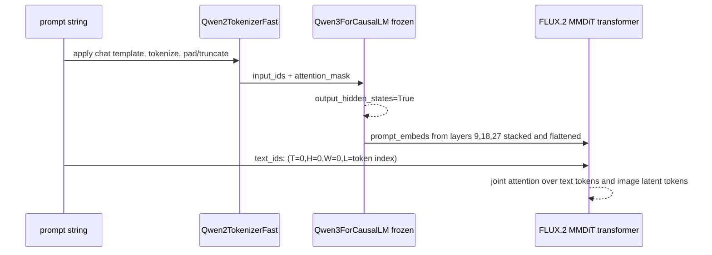

# Adeleine v2 Current Architecture

This describes the implemented FLUX.2 Klein LoRA architecture used by the current checkpoints. It is not the unused `AdeleineConditionAdapter` scaffold in `adapters.py`.
Status: implementation snapshot for 2026-09-30. See [training_methodology.md](training_methodology.md), [validation.md](validation.md), and [takeover.md](takeover.md).

## End-to-end figure

```mermaid
flowchart LR
    subgraph Dataset[Dataset and task sampling]
        A[OpenNiji RGB target image] --> L[Line-art augmentation
XDoG / SketchKeras pencil / digital / anime line / blend]
        A --> H[Atari hint generator
dot or line hints sampled from target colors]
        H --> HRGB[atari_rgb]
        H --> HM[atari_mask]
        A --> R[Reference policy
self / deformed_self / self_deformed / sibling / none]
        A --> MRef[SkyTNT anime foreground mask
cached by reference digest]
        MRef --> R
        A --> T[Prompt text
prompt + style]
        TS[Task sampler
line, line+atari, line+ref, line+text, line+ref+atari, all] --> Drop[Modality dropout]
        L --> Drop
        HRGB --> Drop
        HM --> Drop
        R --> Drop
        T --> Drop
    end

    subgraph ConditionBuild[Condition image construction]
        Drop --> C0[line image]
        Drop --> C1[spatial_atari image
lineart * (1 - mask) + atari_rgb * mask]
        Drop --> C2[mask image
mask repeated to RGB, scaled to [-1, 1]]
        Drop --> C3[reference foreground image(s)
reference * fg_mask + white background]
        Drop --> C4[reference background image(s)
deformed reference with foreground inpainted,
or another record's background]
        C0 --> CI[condition image list]
        C1 --> CI
        C2 --> CI
        C3 --> CI
        C4 --> CI
    end

    subgraph TextPath[Text path]
        Drop --> P[Prompt string
optional text + mode and active-condition suffix]
        P --> QT[Qwen2TokenizerFast
chat template, max length 128 in training]
        QT --> QE[Qwen3ForCausalLM text encoder
frozen]
        QE --> HS[Hidden states from layers 9, 18, 27]
        HS --> PE[prompt_embeds
stack layers, then concat layer dims]
        PE --> TI[text_ids
4D coords: T=0,H=0,W=0,L=token index]
    end

    subgraph ImagePath[Image and latent path]
        A --> VTarget[FLUX.2 VAE encode target
frozen]
        VTarget --> Clean[clean target latent tokens]
        Clean --> Noise[add flow-matching noise
x_t = (1-sigma)*clean + sigma*noise]
        CI --> VCond[FLUX.2 VAE encode each condition image
frozen]
        VCond --> CondTokens[condition latent tokens]
        CondTokens --> CondIDs[image_latent_ids
default T=10,20,30,...]
        CondIDs --> Align[spatial_condition_id_mode
hint_to_output sets spatial_atari T to 0]
        Clean --> TargetIDs[target latent_ids
T=0,H/W grid,L=0]
    end

    subgraph Transformer[FLUX.2 Klein MMDiT transformer]
        Noise --> Cat[concat hidden_states
noisy target tokens + condition tokens]
        CondTokens --> Cat
        TargetIDs --> ImgIDs[concat img_ids
target ids + condition ids]
        Align --> ImgIDs
        PE --> MMDiT[Flux2Transformer2DModel
base frozen + trainable LoRA]
        TI --> MMDiT
        Cat --> MMDiT
        ImgIDs --> MMDiT
        Sig[sigma / timestep] --> MMDiT
        MMDiT --> Pred[predicted flow for all image tokens]
        Pred --> Slice[keep only target-token prediction]
        Slice --> Loss[MSE(pred, noise - clean)]
    end

    subgraph Inference[Inference]
        PE --> InfM[MMDiT denoising loop]
        TI --> InfM
        CI --> InfV[VAE encode conditions]
        InfV --> InfM
        InfM --> Dec[VAE decode final target latents]
        Dec --> Out[colorized image]
    end
```

## Current condition token layout

```mermaid
flowchart TB
    subgraph Inputs[User or dataset inputs]
        L2[lineart RGB, normalized to [-1,1]]
        H2[atari_rgb, normalized to [-1,1]]
        M2[atari_mask, binary 0..1]
        R2[reference RGB image(s), normalized to [-1,1]]
        RM[SkyTNT foreground mask, 0..1]
    end

    L2 --> S1[line condition image]
    L2 --> Fuse[spatial_atari fusion]
    H2 --> Fuse
    M2 --> Fuse
    Fuse --> S2[spatial_atari condition image]
    M2 --> S3[mask RGB condition image]
    R2 --> RF[foreground/background split]
    RM --> RF
    RF --> S4[reference foreground condition image]
    RF --> S5[reference background condition image]

    S1 --> VAE[VAE encode + patchify + pack]
    S2 --> VAE
    S3 --> VAE
    S4 --> VAE
    S5 --> VAE

    VAE --> TOK[condition tokens]
    TOK --> IDs[4D img ids]
    IDs --> ID0[line: default T=10]
    IDs --> ID1[spatial_atari: default T=20, rewritten to T=0 in current server/training]
    IDs --> ID2[mask: T=30]
    IDs --> ID3[reference foreground/background: T=40 and later]
```

## Text transfer into diffusion



## Important implementation notes

- The current trained checkpoint does not use the custom `SpatialConditionAdapter`, `ReferenceImageAdapter`, or `ModePresenceEmbedding` modules in `adapters.py`. Those are scaffolding for a future native adapter/ControlNet-style implementation.
- Text is encoded by FLUX.2 Klein's native frozen `Qwen3ForCausalLM` text encoder. LoRA is applied to the FLUX transformer, not to the text encoder or VAE.
- Reference images are not encoded by DINO/VLM in the current implementation. When `--reference_condition_mode split` is enabled, SkyTNT foreground masks split each reference into foreground and background condition images, both passed through the frozen FLUX.2 VAE.
- For `deformed_self` references, the original SkyTNT mask is geometrically deformed with the same transform as the RGB reference, avoiding per-sample segmentation of random deformations.
- Self references go through the same split as inference references: foreground = deformed reference * deformed mask on white, background = deformed reference with the foreground inpainted (or another record's background with `--reference_background_source other`). Masks are deformed with the RGB border mode so reflected foreground is not mislabelled. Coverage < 2% (no character found) emits the whole reference as background only; > 98% as foreground only.
- Atari hints are made spatial by fusing color hints into the line-art plane as `spatial_atari`. With `hint_to_output`, only the fused hint image's T-coordinate is rewritten to the target output plane `T=0`; mask and reference images keep separate image planes.
- Training objective is flow matching: the transformer predicts `noise - clean` from noisy target latents plus condition tokens. Loss is applied only to target output tokens, not to condition tokens.

## Current trained profile

| Concern | Current choice |
| --- | --- |
| Base model | `black-forest-labs/FLUX.2-klein-base-4B` |
| Trainable model | PEFT LoRA on FLUX.2 transformer attention projections |
| LoRA rank and alpha | 16 and 16, inherited from the spatial-hint checkpoint |
| Frozen components | FLUX.2 VAE, Qwen text encoder, and base transformer weights |
| Image size | 512 x 512, forced square |
| Required condition | Line art |
| Optional conditions | Atari RGB and mask, split reference foreground and background, text |
| Atari representation | Fused line-art and hint image plus explicit mask (`fused_masked`) |
| Spatial ID policy | Fused Atari tokens moved to output T-plane (`hint_to_output`) |
| Reference representation | SkyTNT mask split into VAE-encoded `ref_fg` and `ref_bg` images |
| Reference training policy | Strongly deformed self-reference |
| Objective | Rectified-flow MSE on output tokens only |

This profile is the interaction of CLI arguments, dataset behavior, and inherited adapter configuration. The exact active command is recorded in [takeover.md](takeover.md).

## Module ownership map

| Module | Responsibility | Runtime status |
| --- | --- | --- |
| `conditions.py` | Unified sample and batch contract, task sampling, modality dropout | Active |
| `openniji.py` | Parquet decoding, line and Atari construction, references, deformation | Active |
| `augmentations.py`, `lineart.py` | Line extraction and augmentation | Active |
| `atari.py` | Dot and stroke hint synthesis | Active |
| `reference_conditioning.py` | Masks, foreground and background split, optional tags and WD data | Active |
| `adapters.py` | Tensor conversion and experimental custom adapters | Tensor conversion active; neural adapters unused |
| `flux_klein.py` | FLUX loader boundary, LoRA attachment and serialization | Active |
| `smoke_train_flux_klein.py` | Production training loop despite historical name | Active |
| `evaluate_reference_transfer.py` | Different-image reference transfer and copy detection | Active |
| `web_server.py` | Interactive inference | Active |

## Data contracts

`ColorizationCondition` is the source-level contract. Images are uint8 RGB HWC arrays. Masks are uint8 HWC with one channel. A line image and target normally have shape `512 x 512 x 3`; optional fields may be absent after task sampling.

`UnifiedCollator` produces `ColorizationBatch`. `batch_to_tensors()` converts images to BCHW in `[-1, 1]`, masks to BCHW in `[0, 1]`, and presence flags to float tensors. Reference lists remain ragged per batch item. The current trainer fixes `batch_size=1` per rank, avoiding ragged-list padding.

The ordered image-condition list is significant:

1. `line` is always first.
2. `spatial_atari` follows when Atari is active.
3. `mask` follows in `fused_masked` mode.
4. `ref_fg` and `ref_bg` follow when reference conditioning is active.

`max_condition_images=6` truncates this list. With the current single-reference split profile, the largest normal list is five images. Adding references can silently exclude later layers when the cap is reached.

## Reference anti-copy path

The current reference path intentionally destroys pixel alignment while retaining palette and semantic information:

1. Load the cached SkyTNT mask for the original target and reference digest.
2. Apply the same strong geometry to RGB and mask: optional horizontal flip, rotation up to 25 degrees, scale 0.75 to 1.25, translation up to 18%, elastic displacement, and perspective jitter.
3. Apply photometric noise, optional blur and down-up sampling, and occasional rectangular occlusion to RGB.
4. Create `ref_fg` by compositing the deformed foreground on white.
5. Create `ref_bg` by dilating the foreground hole and inpainting it with OpenCV Telea.
6. Encode both layers with the frozen FLUX VAE as separate image contexts.

Coverage below 2% produces background only; coverage above 98% produces foreground only. A missing mask with `reference_mask_fallback=skip` falls back to the full reference image rather than split layers.

## Trainable parameter boundary

The saved adapter targets:

```text
to_q, to_k, to_v, to_out.0,
add_q_proj, add_k_proj, add_v_proj, to_add_out
```

The current run does not train the VAE, text encoder, a ControlNet, the custom neural adapters in `adapters.py`, or WD semantic projectors. WD projectors are supported by other CLI modes but are not enabled by the active `reference_conditioning=split` run.

## Architectural constraints and risks

- Square resizing changes composition and aspect ratio; there are no aspect-ratio buckets.
- Conditions are native FLUX image contexts, not a dedicated line-art ControlNet.
- `condition_id_policy()` monkey-patches a private diffusers method at inference.
- Training uses private helpers including `_encode_vae_image`, `_pack_latents`, and `_prepare_latent_ids`.
- The name `smoke_train_flux_klein.py` is misleading: it contains the long-running production trainer.
- The custom adapter classes are not checkpoint-compatible with the current model and must not be described as production architecture.
