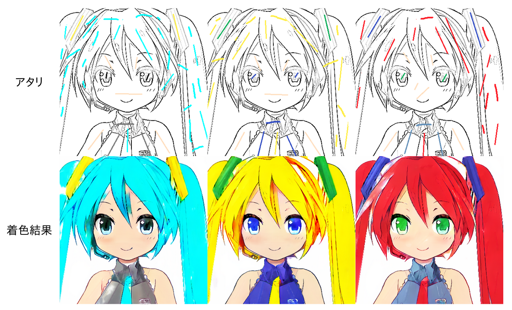
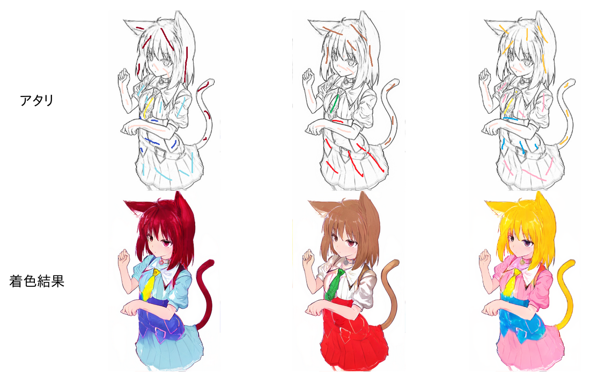
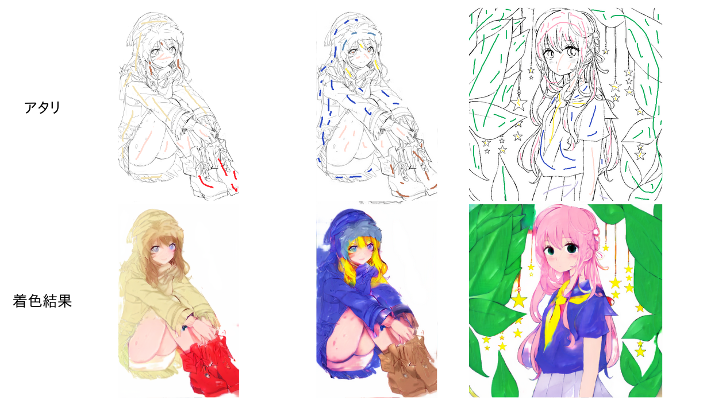

# UserHint

## Summary


- Taking the line art and color hint as input, we generate colored image with the network architecture based on pix2pix.
- We give hidden layers not only line art but also features of line art extracted by VGG16.

## Usage

### Draft Training Phase
Execute the command line below.

```bash
$ python train.py --data_path <DATA_PATH> --sketch_path <SKETCH_PATH> --digi_path <DIGI_PATH>
```
`DATA_PATH`: path which contains color images
`SKETCH_PATH`: path which contains lines obtained by SKetchKeras
`DIGI_PATH`: path which contains lines obtained by Sketch Simplification

### Refinement Training Phase
Execute the command line below.

```bash
$ python train.py --data_path <DATA_PATH> --sketch_path <SKETCH_PATH> --digi_path <DIGI_PATH> --st_path <ST_PATH> --type refine
```
`DATA_PATH`: path which contains color images
`SKETCH_PATH`: path which contains lines obtained by SKetchKeras
`DIGI_PATH`: path which contains lines obtained by Sketch Simplification
`ST_PATH`: path which contains color images processed with spatial transformer

## Results
Result generated by my development environment is below.

| Results |
| ---- |
|  |
|  |
|  |
|  |
|  |
|  |

- Batch size: 16
- Using Adam as optimizer
- The weight of adversarial loss is 0.001 and the weight of content loss is 1.0
