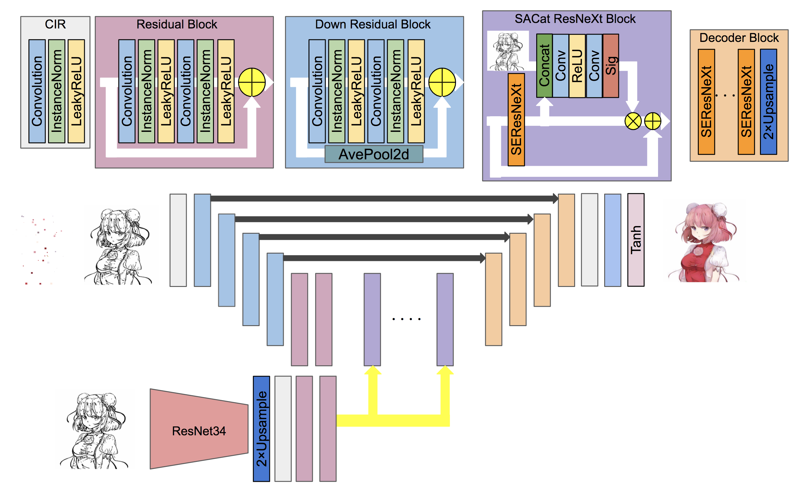

# Userhint V2

## Summary



- There are some modifications to [Userhint V1](../atari_userhint)
  - Color hint strategy used in [the paper](https://richzhang.github.io/InteractiveColorization/)
  - [Line arts feature extractor (ResNet34)](https://github.com/RF5/danbooru-pretrained) that is pre-trained with Danbooru2018
  - Introducing SEResNeXt to generator and discriminator
  - Gradient penalty for stabilizing training of GAN

## Usage
### Training Phase
Execute the command line below.

```
$ python train.py --data_path <DATA_PATH> --sketch_path <SKETCH_PATH> --ss_path <SS_PATH>
```

- `DATA_PATH`: The name of the directory that contains color images
- `SKETCH_PATH`: The name of the directory that contains line arts obtained by SketchKeras
- `SS_PATH`: The name of the directory that contains quantized color images obtained by superpixel

File names of `DATA_PATH` must correspond to those of `SKETCH_PATH`. The examples of dataset structures are as follows.

```
ex1

DATA_PATH - file1.jpg
          - file2.jpg
          ...

SKETCH_PATH - file1.jpg
            - file2.jpg
            ...

SS_PATH - file1.jpg
        - file2.jpg
        ...
```

```
ex2

DATA_PATH - dir1 - file1.jpg
                 - file2.jpg
          - dir2 - file3.jpg
                 - file4.jpg
          ...
          
SKETCH_PATH - file1.jpg
            - file2.jpg
            - file3.jpg
            - file4.jpg
            ...

SS_PATH - file1.jpg
        - file2.jpg
        - file3.jpg
        - file4.jpg
        ...
```


## Results
| Results |
| ---- |
|  |
|  |
|  |
|  |
|  |
|  |
|  |
|  |
|  |
|  |