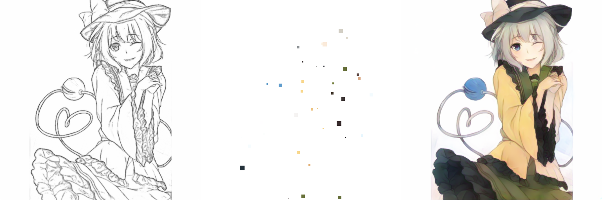
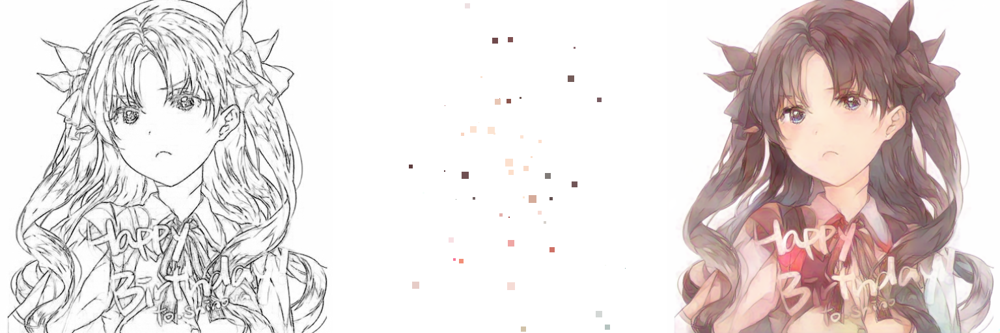

# Userhint V2

## Summary

- There are some modifications to Userhint V1
  - Color hint strategy used in [the paper](https://richzhang.github.io/InteractiveColorization/)
  - Line arts feature extractor (ResNet) that is pre-trained with Danbooru2018
  - Introducing SEResNeXt to generator and discriminator
  - Gradient penalty for stabilizing training of GAN

## Results
| Results |
| ---- |
|  |
|  |
|  |
|  |
|  |
|  |
|  |
|  |
|  |
|  |