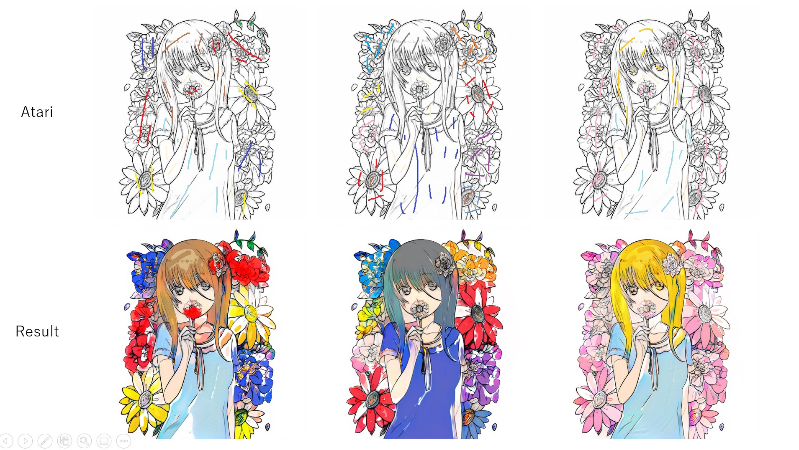
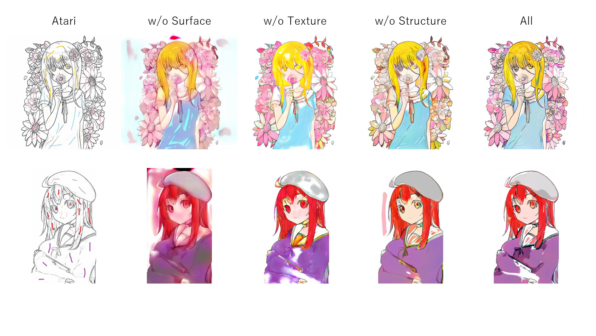

# White Box Colorization

## Summary


- This implementation is based on [this paper](https://openaccess.thecvf.com/content_CVPR_2020/papers/Wang_Learning_to_Cartoonize_Using_White-Box_Cartoon_Representations_CVPR_2020_paper.pdf).

## Usage

### Training Phase
Execute the command line below.

```bash
$ python train.py --data_path <DATA_PATH> --sketch_path <SKETCH_PATH> --ss_path <SS_PATH>
```
- `DATA_PATH`: The name of the directory that contains color images
- `SKETCH_PATH`: The name of the directory that contains line arts obtained by SketchKeras
- `SS_PATH`: The name of the directory that contains quantized color images obtained by `simple_superpixel` function in `utils.py`

File names of `DATA_PATH` must correspond to those of `SKETCH_PATH`. The examples of dataset structures are as follows.

```
ex1

DATA_PATH - file1.jpg
          - file2.jpg
          ...

SKETCH_PATH - file1.jpg
            - file2.jpg
            ...

SS_PATH - file1.jpg
        - file2.jpg
        ...
```

```
ex2

DATA_PATH - dir1 - file1.jpg
                 - file2.jpg
          - dir2 - file3.jpg
                 - file4.jpg
          ...
          
SKETCH_PATH - file1.jpg
            - file2.jpg
            - file3.jpg
            - file4.jpg
            ...

SS_PATH - file1.jpg
        - file2.jpg
        - file3.jpg
        - file4.jpg
        ...
```

## Results

| Results |
| ---- |
|  |
|  |
|  |
