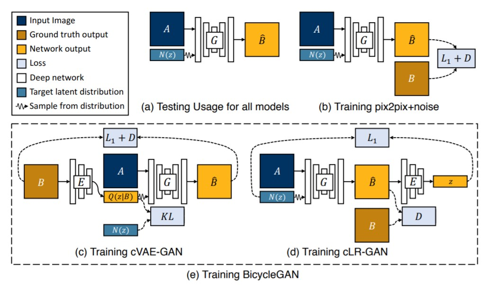
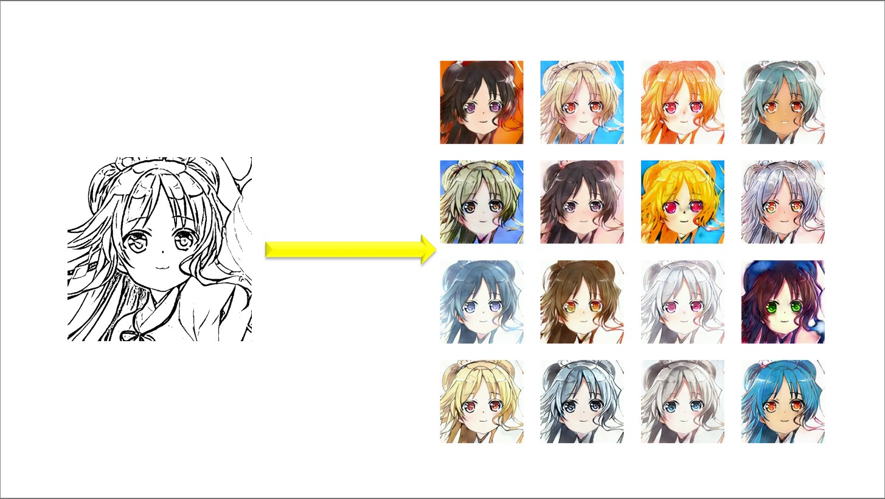
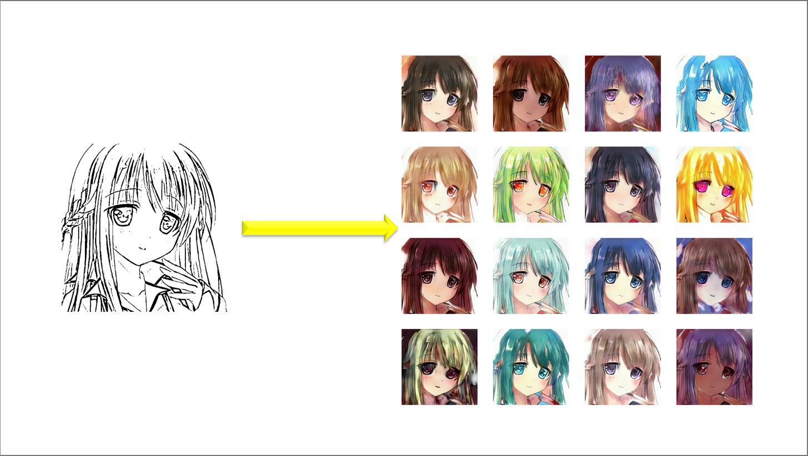

# BicycleGAN

## Summary


- This direcotry implements diverse coloriztion without hint based on [BicycleGAN](https://arxiv.org/pdf/1711.11586.pdf) + [Mode seeking regularizer](https://arxiv.org/pdf/1903.05628.pdf)

## Usage
### Traning Phase
Execute the command line below.

```bash
$ python train.py --data_path <DATA_PATH> --sketch_path <SKETCH_PATH>
```
- `DATA_PATH`: The name of the directory that contains color images
- `SKETCH_PATH`: The name of the directory that contains line arts obtained by SketchKeras

File names of `DATA_PATH` must correspond to those of `SKETCH_PATH`. The examples of dataset structures are as follows.

```
ex1

DATA_PATH - file1.jpg
          - file2.jpg
          ...

SKETCH_PATH - file1.jpg
            - file2.jpg
            ...
```

```
ex2

DATA_PATH - dir1 - file1.jpg
                 - file2.jpg
          - dir2 - file3.jpg
                 - file4.jpg
          ...
          
SKETCH_PATH - file1.jpg
            - file2.jpg
            - file3.jpg
            - file4.jpg
            ...
```

#### Training Options
You have some options in training by rewriting `param.yaml`.

- With or without mode seeking regularizer
  - If you intend to train the model without mode seeking regularizer, you should set `loss.ms` in `param.yaml` to `0.0`
- Dimension of latent space
  - If you intend to train the model with another dimension of latent space, you should change `train.l_dim`, `model.generator.l_dim` and `model.encoder.l_dim`

## Results

| Results |
| ---- |
|  |
|  |
|  |
