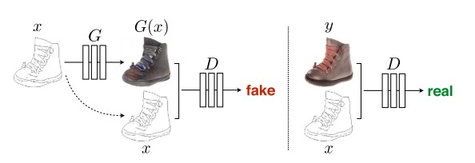
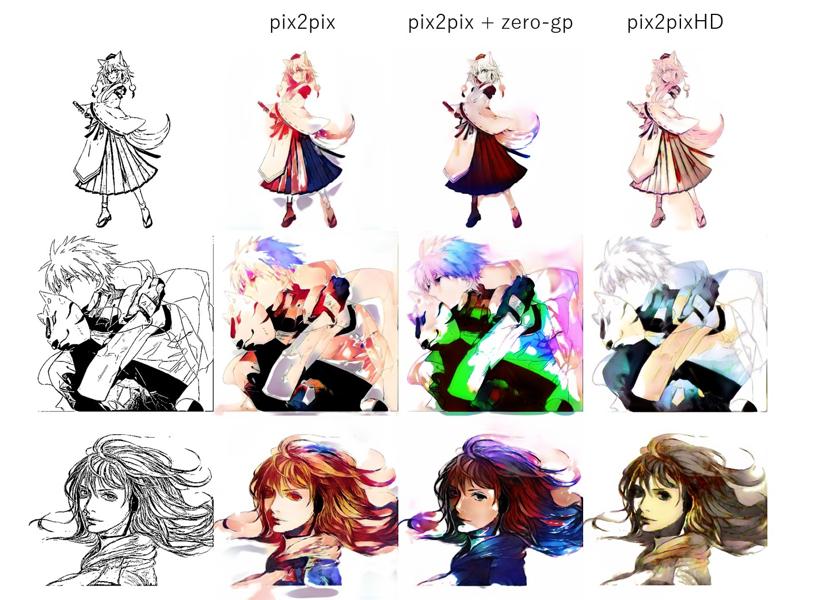
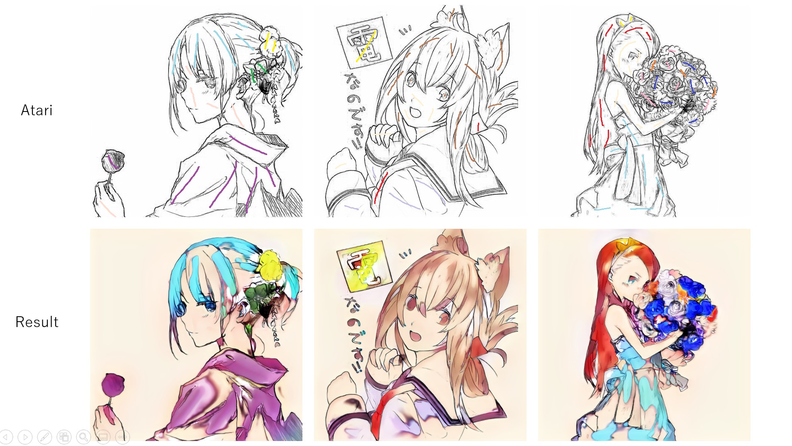
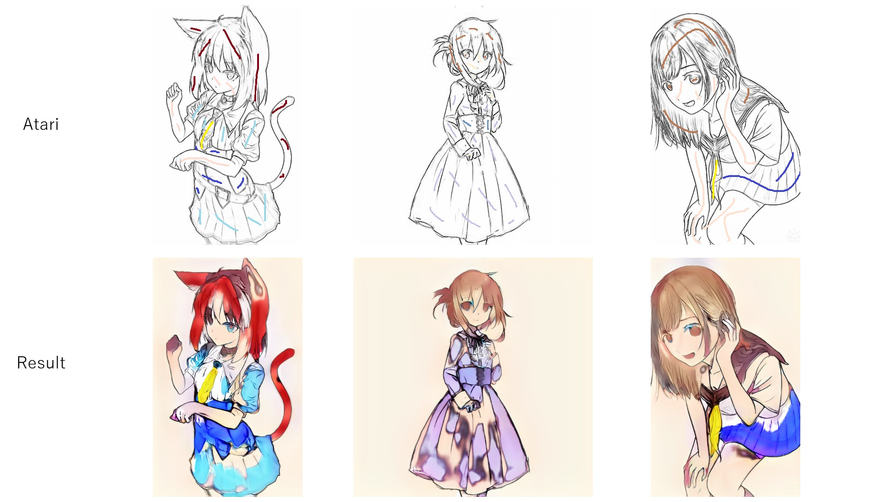
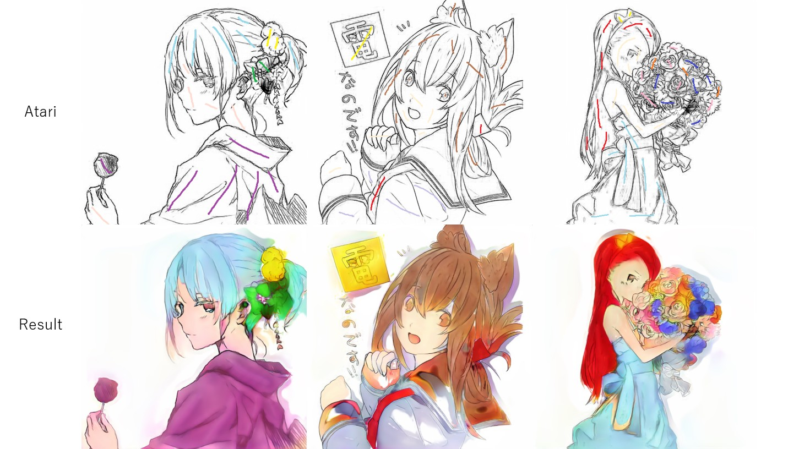
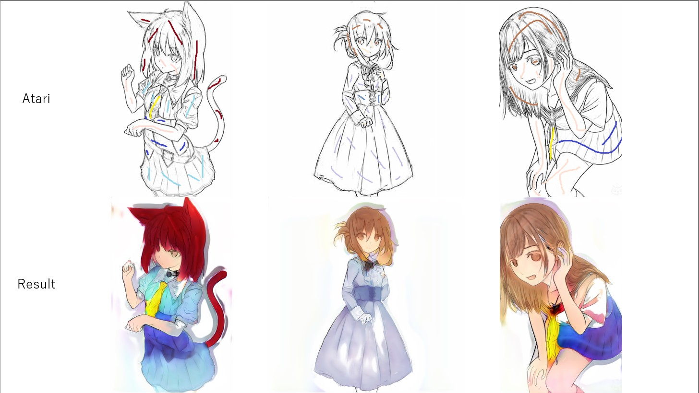

# Colorization with pix2pix
## Summary



- This directory implements colorization without hint based on [pix2pix](https://arxiv.org/pdf/1611.07004.pdf) + zero-centered gradient penalty
- This also implements colorization with atari

## Usage

### Traning Phase
Execute the command line below.

```bash
$ python train.py --data_path <DATA_PATH> --sketch_path <SKETCH_PATH>
```
- `DATA_PATH`: The name of the directory that contains color images
- `SKETCH_PATH`: The name of the directory that contains line arts obtained by SketchKeras

File names of `DATA_PATH` must correspond to those of `SKETCH_PATH`. The examples of dataset structures are as follows.

```
ex1

DATA_PATH - file1.jpg
          - file2.jpg
          ...

SKETCH_PATH - file1.jpg
            - file2.jpg
            ...
```

```
ex2

DATA_PATH - dir1 - file1.jpg
                 - file2.jpg
          - dir2 - file3.jpg
                 - file4.jpg
          ...
          
SKETCH_PATH - file1.jpg
            - file2.jpg
            - file3.jpg
            - file4.jpg
            ...
```

#### Training Options
You have some options in training by rewriting `param.yaml`.

- With or without hint
  - If you intend to train the model without hint, you should set `train.mask` in `param.yaml` to `false`
- With or without gradient penalty
  - If you intend to train the model without gradient penalty, you should set `loss.gp` in `param.yaml` to `0.0`
- zero-centered gradient penalty or one-centered gradient penalty
  - If you intend to train the model with one-centered gradient penalty, you should et `loss.center` in `param.yaml` to `one`

## Result
Result generated by my development environment is below.

| Methods | Results |
| ---- | ---- |
| pix2pix no hint |  |
| pix2pix based on atari|   |
| pix2pix + 0-gp based on atari |   |

- Batch size: 16
- Using Adam as optimizer(lr=0.0002, beta1=0.5, beta2=0.99)
