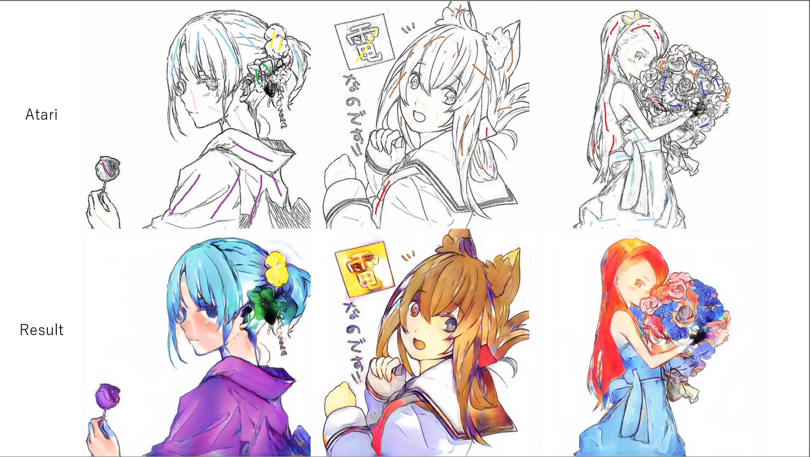

# pix2pixHD

## Summary


## Usage
Execute the command line below
```
$ python train.py --data_path <DATA_PATH> --sketch_path <SKETCH_PATH>
```
`DATA_PATH`: The name of the directory that contains image files  
`SKETCH_PATH`: The name of the directory that contains line art files obtained by SKetchKeras  

## Result

| Methods | Results |
| ---- | ---- |
| pix2pixHD nohint |  |
| pix2pixHD atari |  |

- Batch size: 16
- Using Adam as optimizer
