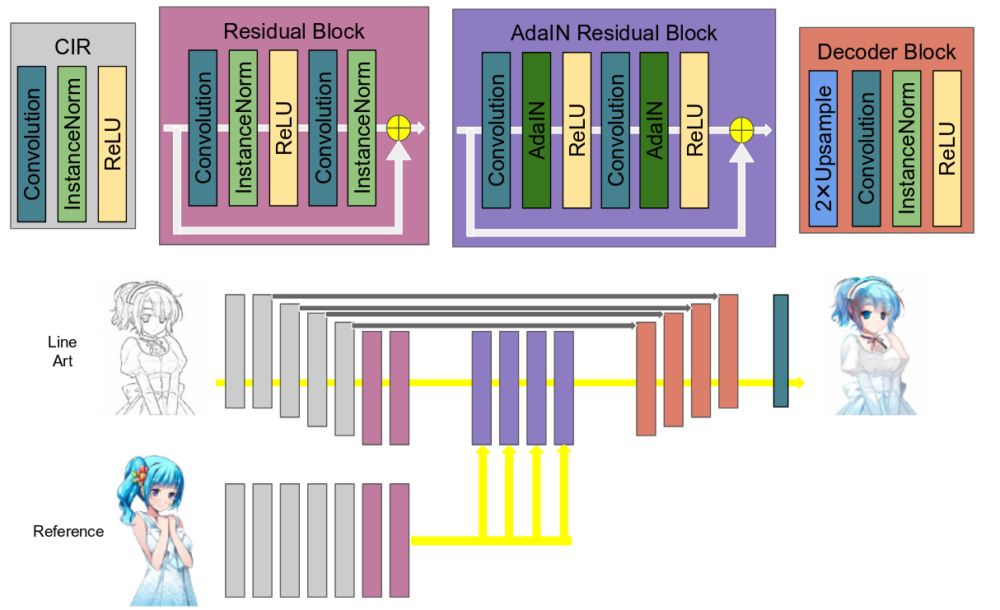

# Colorization With Reference Images By Using AdaIN

## Summary


- This directory implements colorization with reference images using Adaptive Instance Normalization(AdaIN).

## Usage

### Training Phase
Execute the command line below.

```bash
$ python train.py --data_path <DATA_PATH> --sketch_path <SKETCH_PATH>
```
- `DATA_PATH`: The name of the directory that contains color images
- `SKETCH_PATH`: The name of the directory that contains line arts obtained by SketchKeras

File names of `DATA_PATH` must correspond to those of `SKETCH_PATH`. The examples of dataset structures are as follows.

```
ex1

DATA_PATH - file1.jpg
          - file2.jpg
          ...

SKETCH_PATH - file1.jpg
            - file2.jpg
            ...
```

```
ex2

DATA_PATH - dir1 - file1.jpg
                 - file2.jpg
          - dir2 - file3.jpg
                 - file4.jpg
          ...
          
SKETCH_PATH - file1.jpg
            - file2.jpg
            - file3.jpg
            - file4.jpg
            ...
```

## Result

| Results |
| ---- |
|  |
|  |
|  |
