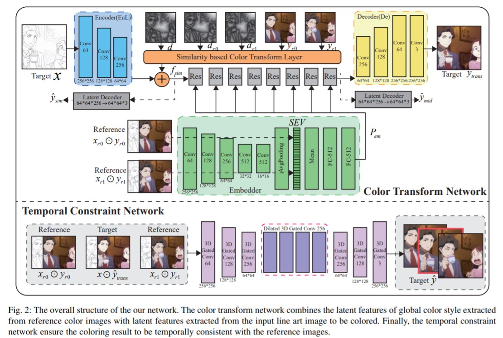

# Video colorization with a few references

## TODO
- [ ] Pushing data preparation code 
- [x] Adding the description of `separate.txt` in dataset.py

## Summary


- This implementation is based on [this paper](https://arxiv.org/pdf/2003.10685.pdf).
- Given the first frame and the last frame of one scene, this model colorizes the rest.

## Usage

### Data Preparation Phase
Three data directories must be made in advance: `DATA_PATH`, `SKETCH_PATH` and `DIST_PATH`:
- `DATA_PATH`: The name of the directory that contains color images
  - Description about the contents of `DATA_PATH`
      - `anime_dir{1,2,3,4}`: These directories must be created in accordance with each movie file. In `anime_dir`, there must be frame files extracted from the movie file using tools (ex. FFmpeg). File names of frames must be in numerical order (ex: 0.jpg, 1.jpg, 2.jpg, 3.jpg).
      - Each `anime_dir` also has `separate.txt` that is obtained by running `select_shot.py`. In order to generate `separate.txt`, please execute the command line below.
      - `$ python select_shot.py --d <ANIME_DIR> --th <THRESHOLD>`
          - `ANIME_DIR`: anime_dir
          - `THRESHOLD`: threshold that indicates the transitions between scenes. This value depends of size of frame files. You may need to set the value on each movie file. 
- `SKETCH_PATH`: The name of the directory that contains line arts obtained by SketchKeras
- `DIST_PATH`: The name of the directory that contains distance field images of lines arts in `SKETCH_PATH`.

```
example

DATA_PATH - anime_dir1 - 0.jpg
                       - 1.jpg
                       ...
                       - separate.txt
          - anime_dir2 - 0.jpg
                       - 1.jpg
                       ...
                       - separate.txt
          ...

SKETCH_PATH - anime_dir1 - 0.jpg
                         - 1.jpg
                         ...
            - anime_dir2 - 0.jpg
                         - 1.jpg
                         ...
            ...

DIST_PATH - anime_dir1 - 0.jpg
                       - 1.jpg
                       ...
          - anime_dir2 - 0.jpg
                       - 1.jpg
                       ...
          ...
```

### Training Color Transform Network Phase
Execute the command line below.

```bash
$ python train.py --data_path <DATA_PATH> --sketch_path <SKETCH_PATH> --dist_path <DIST_PATH>
```
- Descriptions
    - `DATA_PATH`: The name of the directory that contains frame files
    - `SKETCH_PATH`: The name of the direcotry that contains line arts obtained by SketchKeras
    - `DIST_PATH`: The name of the direcotry that contains distance field images of lines arts obtained by SketchKeras

### Training Temporal Constraint Network Phase
Execute the command line below.

```bash
$ python refine.py --data_path <DATA_PATH> --sketch_path <SKETCH_PATH> --dist_path <DIST_PATH> --pre_path <PRETRAIN_PATH>
```
- Descriptions
    - `DATA_PATH`: The name of the directory that contains frame files
    - `SKETCH_PATH`: The name of the direcotry that contains line arts obtained by SketchKeras
    - `DIST_PATH`: The name of the direcotry that contains distance field images of lines arts obtained by SketchKeras
    - `PRETRAIN_PATH`: The name of pretrained Color Transform Network file.

## Result

### Yakusoku no Neverland

| Results |
| ---- |
|  |
|  |
|  |

### Sakura Taisen

| Results |
| ---- |
|  |
|  |
|  |


### Magic Knight Rayearth

| Results |
| ---- |
|  |
|  |
|  |
